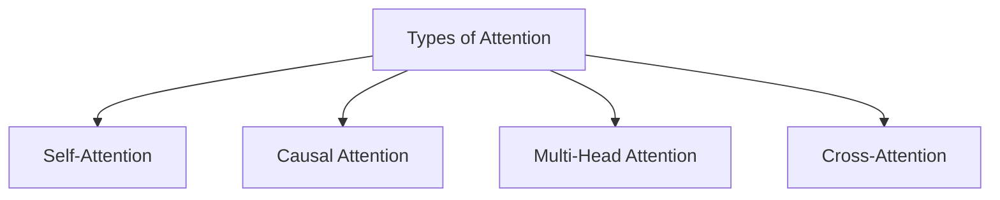

---
{"dg-publish":true,"permalink":"/03-02-00-attention-mechanism/","title":"Attention Mechanism","tags":["geometry-of-intelligence","machine-learning","deep-learning","math","algorithms","attention"],"dg-note-properties":{"title":"Attention Mechanism","tags":["geometry-of-intelligence","machine-learning","deep-learning","math","algorithms","attention"]}}
---

# What is Attention? 

Attention is a **mechanism that lets a model decide what information matters most** when making a prediction.

When you read a sentence:
“The stock surged after the Fed announcement”

Your brain doesn’t weigh every word equally.  
You zoom in on:
- _“surged”_
- _“Fed announcement”_
That selective focus = **attention**
##### In machine learning terms
Attention assigns **weights** to different inputs:

$$[  
\text{Output} = \sum (\text{importance weight}) \times (\text{input})  
]$$

So the model learns:
- what to ignore ❌
- what to emphasize ✅

Financial markets are:
- noisy
- non-stationary
- regime-driven

Attention helps answer:
> “Which past events are relevant to the current market condition?”

---
## Birth of the Transformer

In 2017, [Attention Is All You Need](https://proceedings.neurips.cc/paper_files/paper/2017/file/3f5ee243547dee91fbd053c1c4a845aa-Paper.pdf) by Ashish Vaswani and his team introduced the **Transformer**, a groundbreaking architecture that completely changed the course of Natural Language Processing. Before Transformers, models like RNNs and LSTMs processed text sequentially, making them slow and less effective at capturing long-range dependencies. The paper proposed a bold idea: replace recurrence entirely with **attention mechanisms**, allowing the model to process entire sequences in parallel while learning which words or tokens are most relevant to each other. This innovation dramatically improved training speed, scalability, and performance. The Transformer’s ability to understand context through mechanisms like **self-attention**, **multi-head attention**, and **cross-attention** became the foundation of modern Large Language Models (LLMs). Today, architectures inspired by this paper power models like GPT, BERT, and countless others, enabling applications ranging from chatbots and translation systems to financial sentiment analysis and code generation. “Attention Is All You Need” wasn’t just a research paper; it was the spark that ignited the era of generative AI. 

---
## Types of Attention

There are four main types of attention mechanisms used in Transformer architectures:

- **[[03.02.01 Self-Attention\|03.02.01 Self-Attention]]**
- **[[Causal Attention\|Causal Attention]]**
- **[[Multi-Head Attention\|Multi-Head Attention]]**
- **[[Cross-Attention\|Cross-Attention]]** 

---
